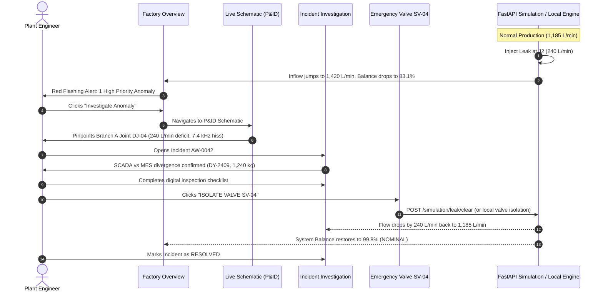

# 🌊 AquaWatch: Production-Aware Industrial Water Loss & Leak Detection

> **An intelligent SCADA + MES telemetry system designed for textile wet-processing manufacturing plants to eliminate false alarms, pinpoint physical pipe leaks in real time, and quantify financial losses under Zero Liquid Discharge (ZLD) tariffs.**

[](https://react.dev/)
[](https://tailwindcss.com/)
[](https://fastapi.tiangolo.com/)
[](https://www.python.org/)
[](https://vitejs.dev/)
[](#financial-impact--zld-tariff-modeler)

---

## 📌 Table of Contents
1. [The Problem: Why Traditional Monitoring Fails](#-the-problem-why-traditional-monitoring-fails)
2. [The Core Innovation: "High Flow ≠ Leak"](#-the-core-innovation-high-flow--leak)
3. [Hydraulic Graph & Physical Mass Balance](#-hydraulic-graph--physical-mass-balance)
4. [User Journey: The 5 Stitch Screens](#-user-journey-the-5-stitch-screens)
5. [Demonstrator Workflow (Anomaly → Investigation → Isolation)](#-demonstrator-workflow-anomaly--investigation--isolation)
6. [Financial Impact & ZLD Tariff Modeler](#-financial-impact--zld-tariff-modeler)
7. [System Architecture](#-system-architecture)
8. [Repository Structure](#-repository-structure)
9. [Quick Start Guide (Frontend + Backend)](#-quick-start-guide)
10. [Presentation & Demo Script](#-presentation--demo-script-for-judges)

---

## 🚨 The Problem: Why Traditional Monitoring Fails

Textile wet-processing facilities (dyeing, bleaching, scouring, washing, rinsing) are among the most water-intensive industrial environments in the world. In manufacturing clusters such as **Tiruppur (Tamil Nadu, India)**, factories operate under stringent **Zero Liquid Discharge (ZLD)** mandates, with freshwater and effluent treatment costs reaching **₹100 – ₹135 per m³**.

### The Static Threshold Failure
Traditional industrial SCADA systems use **static high/low flow thresholds** on main supply headers:
- If water flow exceeds $1,200\text{ L/min}$, an alarm triggers.
- **The Reality**: When production shifts from 100% to 200% capacity (e.g. running 8 heavy-duty jet dyeing autoclaves simultaneously), water demand legitimately jumps from $1,000\text{ L/min}$ to $1,800\text{ L/min}$.
- **Alarm Fatigue**: Operators receive hundreds of false alarms every week. In practice, operators silence or ignore threshold alarms entirely.
- **Undetected Losses**: When a real flange gasket blows or a pipe fractures (introducing a $150–300\text{ L/min}$ leak), it goes undetected for hours or days because the flow is within normal operating ranges.

---

## 💡 The Core Innovation: "High Flow ≠ Leak"

AquaWatch solves this by fusing **real-time hydraulic SCADA telemetry** with **Manufacturing Execution System (MES) production context**:

$$\text{Leak Signal} = Q_{\text{measured}} - Q_{\text{expected}}(\text{Batch Recipe}, \text{Fabric Weight}, \text{Machine States})$$

```
┌────────────────────────────────────────────────────────┐
│            MES Production Context (ERP/Batch)          │
│  - Active Batch: DY-2409                               │
│  - Fabric Weight: 1,240 kg                             │
│  - Recipe Intensity: 0.96 (Heavy Reactive Dyeing)      │
│  - Active Machines: M1..M5 RUNNING, M6..M8 IDLE        │
└──────────────────────────┬─────────────────────────────┘
                           │ Dynamic Expected Flow: 1,185 L/min
                           ▼
              ┌───────────────────────────┐
              │  AquaWatch Dynamic Engine │ ◄── Measured Flow: 1,420 L/min
              └────────────┬──────────────┘
                           │
       Divergence Residual: ΔQ = +235 L/min (Acoustic Cavitation: 7.4 kHz)
                           ▼
          🚨 CONFIRMED PHYSICAL LEAK (87% ML Confidence)
          Pinpointed: Branch A (Line D-01) Joint DJ-04
```

- **Legitimate Production Ramp**: When fabric load increases, expected consumption scales synchronously. Flow reaches $1,650\text{ L/min}$, $\Delta Q \approx 0 \implies$ **Zero False Alarms**.
- **Physical Rupture**: When a gasket blows, observed flow exceeds expected recipe flow, and upstream manifold balance collapses $\implies$ **Instant Pinpoint Alert**.

---

## 🏗 Hydraulic Graph & Physical Mass Balance

The physical distribution network follows a tree topology rooted at Main Ultrasonic Meter $J_1$, branching into four primary manifolds and terminal equipment:

```
                                [ J1: Main Water Header ]
                                           │
       ┌───────────────────┬───────────────┴───────────────┬───────────────────┐
       ▼                   ▼                               ▼                   ▼
 [ J2: Branch A ]    [ J3: Branch B ]                [ J4: Branch C ]    [ J7: Branch D ]
 (Dyeing Manifold)   (Washing Manifold)              (Finishing Line)    (Utility & Boiler)
    ├── J5  (M1)        ├── J8  (M3)                    ├── J11 (M6)        ├── J13 (M8)
    └── J6  (M2)        ├── J9  (M4)                    └── J12 (M7)        ├── J14 (Tap 1)
                        └── J10 (M5)                                        ├── J15 (Tap 2)
                                                                            └── J16 (Tap 3)
```

### Conservation Laws & Localized Deficits
At all times under normal operation:
- $J_1 \approx J_2 + J_3 + J_4 + J_7$ (Main Header Conservation)
- $J_2 \approx J_5 + J_6$ (Branch A Dyeing Conservation)
- $J_3 \approx J_8 + J_9 + J_{10}$ (Branch B Washing Conservation)
- $J_4 \approx J_{11} + J_{12}$ (Branch C Finishing Conservation)
- $J_7 \approx J_{13} + J_{14} + J_{15} + J_{16}$ (Branch D Utility Conservation)

When a physical leak occurs at **Branch A ($J_2$)**:
1. $J_2$ flow increases by $L = 240\text{ L/min}$.
2. $J_1$ flow increases by $240\text{ L/min}$.
3. Downstream terminal meters $J_5$ and $J_6$ measure only what the machines consume ($125\text{ L/min}$ each).
4. **Localized Mass Deficit**:
   $$\Delta Q_{J2} = J_2 - (J_5 + J_6) = 490 - 250 = 240\text{ L/min} \quad (\text{Mass continuity drops to 83.1\%})$$
5. Pressure at header $J_1$ drops from $3.2\text{ bar}$ to $2.4\text{ bar}$ via Darcy-Weisbach friction loss.

---

## 🖥 User Journey: The 5 Stitch Screens

The user interface reproduces the high-density industrial SCADA designs created in Stitch with 100% visual fidelity:

### 1. Factory Overview (`FactoryOverviewScreen.jsx`)
- **Real-Time Header Inflow**: Displays live ultrasonic intake ($1,420\text{ L/min}$) vs dynamic recipe baseline ($1,185\text{ L/min}$).
- **Continuity Metric**: System-wide water balance index ($83.1\%$, down from nominal $99.8\%$).
- **Active Incident Card**: High-priority alert banner linking directly to incident triage.
- **Production Correlation Strip**: Displays active batch (`DY-2409`), fabric weight ($1,240\text{ kg}$), and liquor ratio.

### 2. Live Network Schematic (`LiveNetworkSchematicScreen.jsx`)
- **P&ID SCADA Diagram**: Interactive interactive visualization of the 16 junctions ($J_1 \dots J_{16}$), 8 machines ($M_1 \dots M_8$), and 3 taps.
- **Live Branch Telemetry**: Shows real-time flow (L/min) and pressure (bar) badges on each manifold.
- **Visual Failure Indicators**: Pulsing red rupture indicator on Branch A Joint DJ-04 with acoustic cavitation tag ($7.4\text{ kHz}$).
- **Emergency Valve Controls**: Interactive button to isolate **Servo Valve SV-04** directly from the schematic.

### 3. Anomalies & Telemetry Log (`AnomaliesLogScreen.jsx`)
- **Priority Triage Queue**: Ranked incidents by severity (`CRITICAL`, `MODERATE`, `SENSOR_DRIFT`, `NOMINAL`).
- **Signal-to-Noise Ratio (SNR)**: Multi-sensor diagnostic isolating hydraulic imbalance from ambient machine vibrations.
- **Interactive Filters**: Filter by status (`OPEN`, `INVESTIGATING`, `RESOLVED`) and location (`Branch A`, `Branch B`, `Main Header`).

### 4. Incident Investigation & Root Cause Analysis (`IncidentInvestigationScreen.jsx`)
- **Side-by-Side Dual Chart**: SCADA actual flow curve diverging sharply from MES expected flow curve.
- **Acoustic Waveform Analysis**: High-frequency acoustic emission profile ($7.4\text{ kHz}$ signature of turbulent fluid orifice escape).
- **Interactive 6-Point Inspection Checklist**: Digital SOP for plant engineers (pipeline visual check, servo stem verification, gasket integrity, hydrostatic comparison).
- **Quick Isolation Modal**: One-click command to shut valve `SV-04` and halt water loss immediately.

### 5. Water Loss & Financial Impact (`WaterLossScreen.jsx`)
- **Real-Time Cost Modeler**: Parametric sliders for **Base Water Tariff** (₹100/m³) and **ZLD Surcharge** (₹35/m³).
- **Cumulative Loss Tracker**: Tracks physical volume lost ($3,420\text{ Liters}$) and financial exposure.
- **Projected Loss Cards**:
  - Hourly Loss: **₹1,944 / hr**
  - Shift Loss (8 hrs): **₹15,552 / shift**
  - 30-Day Risk: **₹14.0 Lakhs**
- **Carbon & Water Footprint Metrics**: Quantifies environmental compliance metrics for textile export auditing.

### 6. Bonus: Hardware Node Status (`SystemStatusScreen.jsx`)
- **LoRaWAN Diagnostics**: Signal RSSI (dBm), battery levels (%), and sensor calibration dates across all 16 flow nodes.

---

## 🎬 Demonstrator Workflow (Anomaly → Investigation → Isolation)



---

## 💰 Financial Impact & ZLD Tariff Modeler

In the textile wet-processing sector, water economics are governed by Zero Liquid Discharge regulations:

| Parameter | Value | Industrial Basis |
|---|---|---|
| **Base Municipal Tariff** | ₹100.00 / m³ | Corporation industrial freshwater tariff |
| **ZLD Effluent Treatment Surcharge** | ₹35.00 / m³ | Reverse osmosis (RO) + multi-effect evaporator (MEE) power |
| **Total Effective Tariff** | **₹135.00 / m³** | ₹0.135 per Liter of wasted water |
| **Active Leak Rate** | $240\text{ L/min}$ ($14.4\text{ m}^3\text{/hr}$) | Medium flange gasket rupture |
| **Cost per Hour** | **₹1,944 / hr** | Continuous uncontrolled leakage |
| **Cost per 8-hr Shift** | **₹15,552 / shift** | Single operational shift |
| **Monthly Exposure (30 days)** | **₹13,99,680 (~₹14.0 Lakhs)** | If hidden or attributed to "production" |

> **ROI Demonstration**: By detecting and isolating the leak in **14 minutes** instead of the typical **6-hour manual walkaround**, AquaWatch saves **86,400 Liters** of water and **₹11,664** on a single incident!

---

## 🏛 System Architecture

AquaWatch operates in **Dual-Mode**:

```
┌────────────────────────────────────────────────────────────────────────┐
│                        AQUAWATCH REACT FRONTEND                        │
│                                                                        │
│  [TopAppBar] ────── [ScenarioBar] ────── [SidebarNav]                  │
│       │                    │                  │                        │
│  [Overview]   [Schematic P&ID]   [Anomalies]   [Investigation] [Loss]  │
│       │                    │                  │               │        │
│       └────────────────────┴─────────┬────────┴───────────────┘        │
│                                      ▼                                 │
│                           [TelemetryContext.jsx]                       │
│                                      │                                 │
│                        ┌─────────────┴─────────────┐                   │
│                        ▼                           ▼                   │
│               [Standalone Mode]             [Backend Client]           │
│             (Self-contained dynamic      (backendClient.js)            │
│               simulation engine)                   │                   │
└────────────────────────────────────────────────────┼───────────────────┘
                                                     │ HTTP REST (1.8s poll)
                                                     ▼
┌────────────────────────────────────────────────────────────────────────┐
│                      FASTAPI PHYSICAL SIMULATION                       │
│                         (backend/app/main.py)                          │
│                                                                        │
│   • GET  /state/current      -> Synchronized flows & pressures (J1..16)│
│   • POST /simulation/leak    -> Physical mass deficit injection        │
│   • POST /simulation/clear   -> Emergency valve isolation clearance    │
│   • POST /control/machine    -> Machine loads (0-200%) & states        │
│   • POST /simulation/preset  -> Instant scenario synchronization       │
└────────────────────────────────────────────────────────────────────────┘
```

1. **Standalone Mode (Zero Dependencies)**: Works immediately out of the box with embedded dynamic presets (`Dyeing Zone Leak`, `Normal Production`, `High Production Ramp`, `Valve Stuck Open`, `Sensor Fault`).
2. **Live Backend Mode (FastAPI)**: Automatically detects when the Python simulator is running on `http://127.0.0.1:8000`, streaming real-time physical ticks with Gaussian noise and executing remote valve isolation.

---

## 📂 Repository Structure

```
aquawatch/
├── README.md                           # Master architectural & project documentation
├── package.json                        # Frontend dependencies (React 19, Tailwind, Vite)
├── vite.config.js                      # Vite bundler configuration
├── index.html                          # HTML entrypoint with typography & icons
├── src/
│   ├── main.jsx                        # Application root mount
│   ├── App.jsx                         # Main layout container & screen router
│   ├── index.css                       # Design tokens, fonts, and Tailwind utilities
│   ├── api/
│   │   └── backendClient.js            # Typed API client for FastAPI backend
│   ├── context/
│   │   └── TelemetryContext.jsx        # Unified SCADA state, timer, & tariff engine
│   ├── components/
│   │   ├── layout/
│   │   │   ├── TopAppBar.jsx           # Top header with Live Backend connection badge
│   │   │   └── SidebarNav.jsx          # Collapsible industrial navigation drawer
│   │   └── common/
│   │       ├── ScenarioBar.jsx         # One-click demo scenario switcher
│   │       ├── SimulationModal.jsx     # Parametric physics & leak injection controls
│   │       └── IsolationModal.jsx      # Emergency valve shutoff verification dialog
│   └── screens/
│       ├── FactoryOverviewScreen.jsx   # Screen 1: High-level plant dashboard
│       ├── LiveNetworkSchematicScreen.jsx # Screen 2: Interactive P&ID network diagram
│       ├── AnomaliesLogScreen.jsx      # Screen 3: Multi-sensor anomaly triage queue
│       ├── IncidentInvestigationScreen.jsx # Screen 4: Root-cause analysis & checklist
│       ├── WaterLossScreen.jsx         # Screen 5: Financial tariff & ZLD modeler
│       └── SystemStatusScreen.jsx      # Bonus: LoRaWAN sensor hardware health
└── backend/
    ├── requirements.txt                # Python backend dependencies (FastAPI, Uvicorn)
    ├── Dockerfile                      # Container definition for simulation backend
    └── app/
        ├── main.py                     # FastAPI server entry point & CORS
        ├── dependencies.py             # Singleton session store & simulation engine
        ├── leak_extension_point.py     # Active physical leak injection state manager
        ├── api/
        │   ├── simulation.py           # Tick, pause, resume, reset, leak & preset routes
        │   ├── control.py              # Machine production & tap control routes
        │   ├── state.py                # Current snapshot & history buffer routes
        │   └── network.py              # Topology inspection routes
        └── simulation/
            ├── aggregation.py          # Bottom-up mass-balance flow summation with leaks
            ├── engine.py               # Auto-tick background simulation loop
            ├── pressure_model.py       # Hydraulic friction pressure calculation
            └── production_model.py     # Machine water demand calculation curves
```

---

## 🚀 Quick Start Guide

### Option 1: Run the Frontend Prototype (Standalone)

You can run the full frontend prototype in standalone mode without any Python setup:

```bash
# 1. Install dependencies
npm install

# 2. Launch Vite development server
npm run dev -- --port 3000
```

Open your browser at **`http://127.0.0.1:3000/`**.
The top bar will display `○ SIMULATED (STANDALONE)`, and all interactive scenarios, modals, checklists, and tariff calculators will be 100% active.

---

### Option 2: Run with the Live Physical Simulation Backend

To run both the React frontend and the live Python physical simulation engine:

#### Step A: Start the FastAPI Backend
```bash
cd backend

# (Optional) create and activate a virtual environment
python -m venv .venv
# Windows:
.venv\Scripts\activate
# Linux/macOS:
source .venv/bin/activate

# Install requirements
pip install -r requirements.txt

# Start the simulation server
python -m uvicorn app.main:app --host 127.0.0.1 --port 8000
```

The backend runs on **`http://127.0.0.1:8000`** (Interactive OpenAPI docs at `/docs`).

#### Step B: Start the Frontend
In another terminal:
```bash
npm run dev -- --port 3000
```

Open **`http://127.0.0.1:3000/`**.
The top bar badge will automatically illuminate with **`● BACKEND LIVE (127.0.0.1:8000)`**, and real-time physical ticks from the Python engine will stream across every screen!

---

## 🎤 Presentation & Demo Script (For Judges & Reviewers)

Follow this 3-minute sequence to deliver a high-impact live demonstration:

1. **Introduce the Plant Overview**:
   - Start on **Factory Overview**. Point out the active batch (`DY-2409, 1,240 kg`) and the **Active Leak Alert** (Header inflow: $1,420\text{ L/min}$, Water Balance: $83.1\%$).
   - Note the **`● BACKEND LIVE`** badge confirming communication with the physical simulator.

2. **Showcase the Core Innovation ("High Flow ≠ Leak")**:
   - In the top scenario bar, switch to **"High Production (Valid Ramp)"**.
   - Show that inflow jumps to $1,645\text{ L/min}$ (even higher than the leak!), but the status immediately displays **"All Systems Nominal (99.5% Continuity)"**.
   - Explain: *"Our algorithm recognizes that 2,100 kg of heavy twill fabric was loaded into the autoclaves. No false alarm is raised."*

3. **Pinpoint the Deficit on the P&ID Schematic**:
   - Switch back to **"Dyeing Zone Leak"** and click **"Live Network Schematic"** in the sidebar.
   - Show the interactive P&ID diagram: Branch A (Line D-01) is pulsing red with a $240\text{ L/min}$ deficit and a $7.4\text{ kHz}$ acoustic hiss at Joint DJ-04.

4. **Investigate & Isolate**:
   - Click **"Incident Investigation"**.
   - Point out the side-by-side SCADA vs MES graph showing the exact point where physical flow diverged from recipe demand.
   - Check off the verification items in the interactive **Digital Inspection Checklist**.
   - Click **"SHUT VALVE SV-04"** (or use the Quick Isolation modal).
   - Watch the flow immediately drop by $240\text{ L/min}$, header pressure recover, and system status return to **Nominal**!

5. **Demonstrate Financial Value**:
   - Navigate to **"Water Loss & Financial Impact"**.
   - Adjust the **ZLD Surcharge** slider to show the direct monetary savings ($₹15,552$ saved per shift, $₹14.0$ Lakhs annualized risk mitigated).

---

## 🛠 Tech Stack & Design Tokens

- **Frontend**: React 19, Tailwind CSS 3.4, Vite 6, Lucide Icons, Google Material Symbols Outlined.
- **Backend**: Python 3.11, FastAPI, Uvicorn, Pydantic v2, Gaussian hydraulic noise modeling.
- **Typography**: `IBM Plex Sans` (industrial UI text) + `JetBrains Mono` (real-time telemetry and sensor values).
- **Design Tokens**: Standardized Stitch palette with industrial safety semantics (`#0F52BA` Primary Sapphire, `#BA1A1A` Critical Red, `#1B6D24` Nominal Green, `#D97706` Warning Amber).

---

## 👥 Team Members

| Member | Primary Focus Area |
|---|---|
| **shivesa** | Frontend SCADA Architecture, Stitch UI Implementation, React, Tailwind CSS |
| **rithick c r** | Physical Simulation Backend, FastAPI Service, Hydraulic Mass-Balance Engine |

---

## 📜 License

This project is licensed under the [MIT License](LICENSE).
Built for industrial sustainability and smart water stewardship.
